# System Architecture — UAV Autonomy Stack

> Single source of truth. Last updated 2026-05-17.
>
> Assumed state: VLM-exploration + Semantic-VSLAM + Brain integration complete (per `INTEGRATION.md`), NanoOWL inference online, deployed on Jetson Orin Nano.
>
> Companion docs:
> - `INTEGRATION.md` — VLM exploration, semantic VSLAM, intent-routing brain wiring
> - `PLANNER_BENCHMARK_DRAFT.md` — MP vs MP+ESDF ablation
> - `PLANNER_ALTERNATIVES_REJECTED.md` — why EGO / MIGHTY / DWA-3D were ruled out
> - `EMERGENCY_LANDING_SIM_ANALYSIS.md` — emergency landing FSM integration
> - `../px4_sim/PX4_VERSION_MIGRATION.md` — keeping SITL aligned with hardware

---

## 1. Context

The system is an autonomous UAV (F450 + Pixhawk FMU-V3, PX4 v1.16.1) for indoor inspection. Compute lives on a **Jetson Orin Nano (8 GB)**. Perception is built around an Intel RealSense D415 (stereo IR + RGBD; no onboard IMU) plus 5× MaixSense MS-A010 ring ToFs + 1× bottom-facing depth.

The system has three commanded-autonomy modes and one safety mode:

1. **Analyse** — user asks "what do you see?" → brain captures current frame → VLM describe → response published. Drone hovers.
2. **Exploit** — user names a known landmark (e.g. "go to the workbench") → brain looks up the pose in the Redis semantic graph → publishes target → planner executes.
3. **Explore** — user names an unknown target → brain forwards to the VLM spatial-grounding pipeline → ground a 2D pixel + depth into a 3D pose → planner executes.
4. **Emergency landing** — on battery low, signal loss, sensor failure, or VSLAM tracking loss, the Emergency Landing FSM takes over via the cmd_vel mux.

Layered on top:
- **Perception**: cuVSLAM (stereo, `map → odom`) + nvblox (dense ESDF) + NanoOWL detector → semantic graph in Redis
- **Self-adaptation**: cmd_vel mux, VSLAM tracking watchdog, health monitors
- **Flight Control**: PX4 onboard, `setpoint_publisher_node` managing offboard lifecycle with ROTATING / AUTONOMOUS FSM

---

## 2. Node inventory

Status legend:
- 🟢 **GREEN** — built & integrated in `planner_ws`
- 🔵 **BLUE** — v1 shipped, optimisation pending
- 🟡 **YELLOW** — TODO, not started
- ⬜ **WHITE** — external (firmware / hardware)
- ⬛ **GRAY** — sim-only

### 2.1 Perception

| Node | Status | Package / path | Subscribes | Publishes | Owner |
|---|---|---|---|---|---|
| Realsense Camera Driver | 🟢 | apt `ros-humble-realsense2-camera` + `uav_hardware_bringup/launch/realsense.launch.py` | USB | `/drone/stereo/{left,right}/{image,camera_info}`, `/drone/rgbd/{image,depth,camera_info,points}` | shared |
| ToF MaixSense ring ×5 | 🟢 | `maixsense_ws/sipeed_tof_ms_a010_ros` + `uav_hardware_bringup` relays | `/dev/maixsense_tof_<0..4>` (USB) | `/drone/tof_<N>/{depth,points}` | shared |
| Bottom depth sensor | 🟢 | 6th MaixSense, bottom-facing | USB | `/drone/bottom_cam/depth` (sim) / `/sensor_bottom/depth/image_raw` (landing) | shared |
| Cloud Merge Node | 🟢 | `cloud_merge/src/cloud_merge_node.cpp` | `/drone/tof_<0..4>/points` | `/drone/tof_merged/points` (frame `base_link`) | shared |
| PX4 Odom Bridge | 🟢 | `cloud_merge/src/px4_odom_bridge.cpp` | `/fmu/out/vehicle_odometry` | `/drone/odom` (ENU), TF `odom → base_link` | shared |
| TF Static Broadcaster | 🟢 | `cloud_merge/src/tf_static_broadcaster.cpp` | (params) | TF: `map → odom` (gated by `publish_map_to_odom`), `base_link → {tof_N_link, rgbd_cam_link, stereo_{left,right}_cam_optical_frame, ...}` | shared |
| Stereo Camera Info Publisher | ⬛ sim only | `cloud_merge/src/stereo_camera_info_publisher.cpp` | (params) | `/drone/stereo/{left,right}/camera_info` | shared |
| **cuVSLAM Node** | 🟢 | `isaac_vslam.sif` invoked by `uav_bringup/launch/vslam.launch.py` | stereo + camera_info | TF `map → odom`, `visual_slam/tracking/vo_pose`, `visual_slam/status`, `visual_slam/vis/*` | shared |
| **nvblox Node** | 🟢 | `isaac_vslam.sif` invoked by `vslam.launch.py` | cuVSLAM pose + `/drone/rgbd/depth` + `/drone/rgbd/camera_info` | `nvblox_node/static_esdf_pointcloud`, `static_map_slice`, mesh | shared |

### 2.2 Semantic / Reflection layer (NanoOWL + Redis graph)

| Node | Status | Package / path | Subscribes | Publishes | Owner |
|---|---|---|---|---|---|
| NanoOWL Inference | 🟢 | `uav_semantic_slam/uav_semantic_slam/nanoowl_inference_node.py` (TensorRT engine at `/opt/nanoowl/data/owl_image_encoder_patch32.engine`) | `/drone/rgbd/image`, `/nanoowl/query` (optional dynamic prompt) | `/nanoowl/detections` (`vision_msgs/Detection2DArray`, `class_id = label_string`) | semantic track |
| Semantic Graph Combiner | 🟢 | `uav_semantic_slam/uav_semantic_slam/semantic_graph_combiner_node.py` | cuVSLAM pose, `/nanoowl/detections`, `/drone/rgbd/camera_info` | `/semantic_graph` (`std_msgs/String`, JSON) | semantic track |
| Redis Writer | 🟢 | `uav_semantic_slam/uav_semantic_slam/redis_writer_node.py` | `/semantic_graph` | Redis: `semantic_graph:latest`, `semantic_graph:robot_pose`, `semantic_graph:node:<id>` (HASH), `semantic_graph:nodes_index` (ZSET by `last_seen_sec`), pubsub channel `semantic_graph` | semantic track |
| Redis (server) | 🟢 | `redis-server` (systemd, `localhost:6379`) | Redis protocol | persistent landmark store | shared |

### 2.3 Goal Management & Brain

| Node | Status | Package / path | Subscribes | Publishes | Owner |
|---|---|---|---|---|---|
| User Instruction Interface | 🟢 | `uav_vlm/uav_vlm/user_instruction_node.py` | stdin | `/user/instruction` (`std_msgs/String`) | brain track |
| **uav_brain (intent router)** | 🟢 | `uav_brain/uav_brain/brain_node.py` | `/user/instruction`, Redis `semantic_graph:*`, `/drone/rgbd/image` | `/spf/target_pose` (analyse → none; exploit → from Redis; explore → forwards to grounding), `/user/instruction_explore`, `/uav/scene_report` (`std_msgs/String`), `/uav/brain_status` | brain track |
| VLM Spatial Grounding | 🟢 | `uav_vlm/uav_vlm/vlm_spatial_grounding.py` | `/user/instruction_explore`, `/drone/rgbd/{image,depth}`, `/drone/odom` | `/spf/target_pose` (`PoseStamped`, frame `map`) | brain track |
| SPF Orchestrator | 🟢 | `uav_global_planner/uav_global_planner/spf_orchestrator.py` | `/spf/target_pose`, `/uav/emergency_trigger`, `/uav/mission_complete` | action goals to `/uav/navigate_to_goal`, `/uav/global_planner_status` | brain track |
| Planner Server (A* + spf_direct_mode) | 🟢 | `uav_planner_interface/src/planner_server_node.cpp` | action `/uav/navigate_to_goal`, nvblox ESDF | `/uav/global_path` (`nav_msgs/Path`) | shared |

### 2.4 Local Planning

| Node | Status | Package / path | Subscribes | Publishes | Owner |
|---|---|---|---|---|---|
| Waypoint Manager (SPF FSM) | 🟢 | `uav_local_planner/src/waypoint_manager_node.cpp` | `/uav/navigate_to_goal` (action), `/uav/global_path`, `/drone/odom` | `/uav/current_waypoint` (`PointStamped`), `/uav/mission_phase` (`std_msgs/String` — IDLE \| ROTATING \| TRANSLATING \| COMPLETE), `/uav/mission_complete` | shared |
| Dynamic Planner — `mp_node` (baseline, raw cloud) | 🔵 v1 shipped | `uav_local_planner/src/mp_node.cpp` | `/drone/rgbd/points`, `/drone/odom`, `/uav/current_waypoint`, `/uav/mission_phase` | `/uav/cmd_vel` (`TwistStamped`), `/uav/mp_diag` | shared |
| Dynamic Planner — `mp_esdf_node` (ESDF variant) | 🟢 | `uav_local_planner/src/mp_esdf_node.cpp` | `/nvblox_node/static_esdf_pointcloud`, `/drone/odom`, `/uav/current_waypoint` | `/uav/cmd_vel`, `/uav/mp_diag` (with `esdf_mode=1.0` + `esdf_voxel_count`) | shared |
| Motion Primitives library | 🟢 | `uav_local_planner/src/motion_primitives.cpp` | (linked into both planner nodes) | (provides `updateBuffer`/`updateEsdf`/`update`/`updateWithEsdf` scoring entrypoints) | shared |

Backend selection: `planner_backend:={mp, mp_esdf}` launch arg on `local_planner.launch.py`. Both share `config/mp_params.yaml`.

### 2.5 Self-Adaptation

| Node | Status | Package / path | Subscribes | Publishes | Owner |
|---|---|---|---|---|---|
| cmd_vel Mux / Mode Arbiter | 🟡 | (planned) `uav_safety/src/cmd_vel_mux.cpp` | `/uav/cmd_vel`, `/landing/cmd_vel`, `/landing/enable` | `/uav/cmd_vel_safe` → setpoint_publisher | shared |
| VSLAM Tracking Watchdog | 🟡 | (planned) `uav_safety/src/vslam_watchdog.cpp` | `visual_slam/status` | `/uav/emergency_trigger` (`Bool`) | shared |
| Health Signal Adapters | 🟡 | (planned) `uav_health_signals/*` | `/fmu/out/battery_status`, `/fmu/out/manual_control_input`, sensor freshness | `/battery_percent`, `/signal_ok`, `/sensor_ok` | shared |
| Geo-fence, RTL on RC loss, pre-arm | 🟢 native | PX4 firmware + QGC config | RC / GPS | PX4 internal failsafe | flight control |

### 2.6 Flight Control

| Node | Status | Package / path | Subscribes | Publishes | Owner |
|---|---|---|---|---|---|
| Setpoint Publisher (SPF FSM: STARTUP → TAKEOFF → HOVER → ROTATING → AUTONOMOUS) | 🟢 | `uav_control/src/setpoint_publisher_node.cpp` | `/uav/cmd_vel` (or `_safe` post-mux), `/uav/mission_phase`, `/fmu/out/vehicle_status_v2`, `/fmu/out/vehicle_local_position_v2` (hardware) | `/fmu/in/trajectory_setpoint`, `/fmu/in/offboard_control_mode`, `/fmu/in/vehicle_command` | shared |
| Emergency Landing Node | 🟢ᵃ | `uav_emergency_landing/.../emergency_landing_node_px4.py` | 6 depth images, `/battery_percent`, `/signal_ok`, `/sensor_ok`, `/landing/offboard_ready` | `/landing/cmd_vel`, `/landing/enable`, `/emergency_landing_status` | landing track |
| Pixhawk Offboard Bridge (landing) | 🟢ᵃ | `.../pixhawk_offboard_bridge.py` | `/landing/cmd_vel`, `/landing/enable`, `/fmu/out/vehicle_status` | `/fmu/in/*`, `/landing/offboard_ready` | landing track |
| MicroXRCE-DDS Agent | 🟢 | external `MicroXRCEAgent` binary | PX4 over USB serial or UDP | `/fmu/out/*`, accepts `/fmu/in/*` | shared |
| PX4 Firmware | ⬜ | Pixhawk FMU-V3, v1.16.1 | sensors, RC | flight | flight controller |
| GPS + onboard IMU | ⬜ | Pixhawk | — | feeds PX4 EKF2 | flight controller |

### 2.7 Sim-only support

| Node | Status | Package / path | Notes |
|---|---|---|---|
| ros_gz_bridge | ⬛ | `ros-humble-ros-gzharmonic` apt | Gazebo ↔ ROS 2 topic bridge |
| Gazebo cmdvel bridge | ⬛ | `emergency_landing_sim/gazebo_cmdvel_bridge` | Twist → SetEntityState; floor-detection (landing-sim only) |

---

## 3. Top-level data flow

```
   stdin
     │ /user/instruction
     ▼
   uav_brain  ──── reads Redis semantic_graph:* ───── (Redis on localhost:6379)
     │
     ├── analyse:  /uav/scene_report  ◄── one-shot VLM describe
     │
     ├── exploit:  /spf/target_pose (built from Redis position_world)
     │
     └── explore:  /user/instruction_explore ──► vlm_spatial_grounding
                                                       │  /spf/target_pose
                                                       ▼
                                              SPF Orchestrator
                                                       │ action /uav/navigate_to_goal
                                                       ▼
                                              Planner Server
                                                       │ /uav/global_path
                                                       ▼
                                         Waypoint Manager (FSM)
                                          ┌────────────┼─────────────┐
                                  ROTATING│   TRANSLATING            │ COMPLETE
                                          │            │             │
                          /uav/mission_phase + /uav/current_waypoint │
                                          │            │             │
                                          ▼            ▼             ▼
                                       mp_node OR mp_esdf_node      (idle)
                                        │ /uav/cmd_vel
                                        ▼
                                   cmd_vel MUX  ◄── /landing/cmd_vel (if /landing/enable)
                                        │ /uav/cmd_vel_safe
                                        ▼
                              Setpoint Publisher (HOVER → ROTATING → AUTONOMOUS)
                                        │ /fmu/in/trajectory_setpoint
                                        ▼
                                MicroXRCE-DDS Agent ──► PX4 ──► motors

   Perception:
     D415 stereo + camera_info ──► cuVSLAM ──► TF map→odom + pose
                                       │
                                       ├──► nvblox ──► /nvblox_node/static_esdf_pointcloud ──► mp_esdf_node + planner_server
                                       │
                                       └──► /visual_slam/tracking/vo_pose ──► semantic_graph_combiner
                                                                                       ▲
                                       D415 RGB ──► NanoOWL ──► /nanoowl/detections ───┘
                                                                                       │
                                                                                       ▼
                                                                              redis_writer ──► Redis ──► uav_brain

   Watchdogs (VSLAM tracking, health signals) ──► /uav/emergency_trigger ──► Emergency Landing FSM ──► /landing/cmd_vel
```

---

## 3.1 System node graph

> Renders in any Mermaid-aware viewer.
> Layout: sensors on left → flow rightward through perception, semantic, brain, planning, safety, control → motors on right.

```mermaid
graph LR
    %% ─────────── SENSORS ───────────
    subgraph SEN["📷 Sensors"]
        direction TB
        D415["RealSense D415<br/>stereo IR + RGBD"]
        TOFx5["MaixSense ToF ×5<br/>(ring)"]
        BTM["MaixSense bottom"]
    end

    %% ─────────── PERCEPTION ───────────
    subgraph PER["Perception"]
        direction TB
        CM["Cloud Merge<br/>/drone/tof_merged"]
        POB["PX4 Odom Bridge<br/>NED → ENU"]
        TFB["TF Static<br/>Broadcaster"]
        CV["cuVSLAM<br/>map → odom"]
        NV["nvblox<br/>ESDF voxel hash"]
    end

    %% ─────────── SEMANTIC LAYER ───────────
    subgraph SEM["Semantic Layer"]
        direction TB
        NOWL["NanoOWL<br/>TensorRT inference"]
        SGC["Semantic Graph<br/>Combiner"]
        RW["Redis Writer"]
        REDIS[("Redis<br/>semantic_graph:*")]
    end

    %% ─────────── BRAIN + GOAL ───────────
    subgraph BRAIN["Brain + Goal Management"]
        direction TB
        UII["User Instruction<br/>stdin → /user/instruction"]
        BR["uav_brain<br/>LLM intent routing"]
        VSG["VLM Spatial<br/>Grounding (explore)"]
        AN["analyse_helper<br/>(VLM describe)"]
        SPFO["SPF Orchestrator"]
        PS["Planner Server<br/>A* + spf_direct_mode"]
    end

    %% ─────────── PLANNING ───────────
    subgraph PLAN["Local Planning"]
        direction TB
        WPM["Waypoint Manager<br/>IDLE→ROTATING→<br/>TRANSLATING→COMPLETE"]
        MP["mp_node<br/>(raw cloud)"]
        MPE["mp_esdf_node<br/>(ESDF voxel hash)"]
    end

    %% ─────────── SAFETY ───────────
    subgraph SAF["Safety"]
        direction TB
        MUX["cmd_vel Mux"]
        WD["VSLAM Watchdog"]
        HSA["Health Adapters"]
    end

    %% ─────────── EMERGENCY LANDING ───────────
    subgraph LND["Emergency Landing"]
        direction TB
        EL["Emergency Landing<br/>FSM"]
        POB2["Pixhawk Offboard<br/>Bridge"]
    end

    %% ─────────── FLIGHT CONTROL ───────────
    subgraph CTRL["Flight Control"]
        direction TB
        SP["Setpoint Publisher<br/>HOVER → ROTATING<br/>→ AUTONOMOUS"]
        DDS["MicroXRCE-DDS<br/>Agent"]
        PX4["PX4 Firmware<br/>+ Pixhawk IMU/GPS"]
    end

    MOT(["⚙ Motors"])

    %% ───── Sensor inputs ─────
    D415 --> CM
    TOFx5 --> CM
    BTM --> CM
    D415 -- stereo --> CV
    D415 -- RGBD depth --> NV
    D415 -- RGB --> NOWL

    %% ───── Perception flow ─────
    DDS -- /fmu/out/odom --> POB
    POB --> CV
    CV --> NV
    CV -- vo_pose --> SGC
    CV -- status --> WD

    %% ───── Semantic ─────
    NOWL -- /nanoowl/detections --> SGC
    SGC -- /semantic_graph (JSON) --> RW
    RW --> REDIS

    %% ───── Brain ─────
    UII -- /user/instruction --> BR
    REDIS -. labels lookup .-> BR
    BR -- exploit: /spf/target_pose --> SPFO
    BR -- explore: /user/instruction_explore --> VSG
    BR --> AN
    D415 -- RGB --> AN
    D415 -- RGB+depth --> VSG
    VSG -- /spf/target_pose --> SPFO

    %% ───── Goal → Planning ─────
    SPFO -- action /uav/navigate_to_goal --> PS
    PS -- /uav/global_path --> WPM
    NV -. ESDF .-> PS
    WPM -- waypoint + mission_phase --> MP
    WPM -- waypoint + mission_phase --> MPE
    NV -- ESDF --> MPE

    %% ───── Safety ─────
    WD -- emergency_trigger --> SPFO
    WD -- emergency_trigger --> EL
    DDS -- /fmu/out/battery_status --> HSA
    HSA --> EL

    %% ───── cmd_vel path ─────
    MP -- /uav/cmd_vel --> MUX
    MPE -- /uav/cmd_vel --> MUX
    EL -- /landing/cmd_vel --> MUX
    EL -- /landing/enable --> MUX
    MUX -- /uav/cmd_vel_safe --> SP
    WPM -. mission_phase .-> SP

    %% ───── Landing direct bypass ─────
    EL --> POB2
    POB2 --> DDS

    %% ───── Flight control output ─────
    SP -- /fmu/in/trajectory_setpoint --> DDS
    DDS --> PX4
    PX4 --> MOT

    %% ───── Color classes ─────
    classDef green   fill:#4caf50,stroke:#1b5e20,color:#fff,font-weight:bold
    classDef blue    fill:#42a5f5,stroke:#0d47a1,color:#fff,font-weight:bold
    classDef yellow  fill:#fff176,stroke:#f57f17,color:#000,font-weight:bold
    classDef white   fill:#fafafa,stroke:#616161,color:#000
    classDef store   fill:#ce93d8,stroke:#4a148c,color:#000,font-weight:bold

    %% Built & integrated (post-INTEGRATION.md)
    class D415,TOFx5,BTM,CM,POB,TFB,CV,NV,NOWL,SGC,RW,UII,BR,VSG,AN,SPFO,PS,WPM,MPE,SP,DDS,EL,POB2 green

    %% v1 shipped, optimisation pending (still active in benchmark)
    class MP blue

    %% TODO
    class MUX,WD,HSA yellow

    %% External
    class PX4,MOT white

    %% Redis backing store
    class REDIS store
```



### Reading the graph

- **Solid arrows** = primary data flow (every cycle)
- **Dotted arrows** = control signals, optional inputs, conditional flows, Redis queries
- **Action arrows** labeled "action" = ROS 2 action server calls (with feedback + result)
- **`REDIS` purple cylinder** = persistent landmark store (out-of-band of DDS; brain polls via `redis` Python client)

Key observations:
- **Brain is the single decision point** for analyse / exploit / explore. Everything downstream (`SPFO → PS → WPM → MP[E] → SP → DDS → PX4`) is mode-agnostic.
- **cuVSLAM is the most-connected perception node** — sink for D415 stereo + odometry feedback, source for nvblox, semantic combiner, watchdog, and `map→odom` TF.
- **Redis is the only non-DDS data path** in the stack. Used because the semantic graph is queried sparsely (once per user instruction), accumulated continuously (5 Hz writes), and persists across restarts. Treating it as a topic would have meant either replaying the full graph every cycle or maintaining a stateful subscriber in the brain.
- **mp_esdf_node and mp_node are mutually exclusive** at runtime — `planner_backend` launch arg picks one. Both still ship for the ablation in `PLANNER_BENCHMARK_DRAFT.md`.
- **`mp_esdf_node` does not yet honour `mission_phase=ROTATING`** — v1.1 cleanup, tracked in INTEGRATION.md risks. For now, only `mp_node` is wired through `uav_brain` exploit/explore paths; `mp_esdf_node` is used standalone for benchmark runs.

---

## 4. TODO (sectioned)

### 4.1 Safety layer

1. **cmd_vel Mux** (`uav_safety/src/cmd_vel_mux.cpp`, ~70 lines) — when `/landing/enable: true`, suppress `/uav/cmd_vel` and forward `/landing/cmd_vel`. Wraps the bare `Twist` into `TwistStamped` (type mismatch with the landing node — see INTEGRATION risks).
2. **VSLAM Tracking Watchdog** (`uav_safety/src/vslam_watchdog.cpp`) — monitor `visual_slam/status`, fire `/uav/emergency_trigger` after >2s of `vo_state != TRACKING`. Also forward to `SPF Orchestrator` so the active mission aborts cleanly.
3. **Health Signal Adapters** (`uav_health_signals/*`):
   - `/battery_percent` (`Float32`) ← `/fmu/out/battery_status`
   - `/signal_ok` (`Bool`) ← PX4 commander state / RC freshness
   - `/sensor_ok` (`Bool`) ← cuVSLAM status + per-sensor freshness aggregator

### 4.2 Planner benchmark (per `PLANNER_BENCHMARK_DRAFT.md`)

1. **Phase B verification** — end-to-end smoke of `mp_esdf_node` with `with_vslam:=true planner_backend:=mp_esdf`. Currently blocked on Gazebo lag root-cause.
2. **Phase D harness** — `uav_benchmark/` package: scenarios (straight_corridor, two_pillar_slalom, narrow_gap, dead_end_recovery, long_traverse), `run_comparison.py`, `analyse_bags.py`, `plot_results.py`.
3. **Phase E** — 200 sim runs (2 configs × 5 scenarios × 20 seeds), report.

### 4.3 Brain v1.1

1. **Lift `mission_phase` gate** out of `mp_node.cpp` into `MotionPrimitives` library so both `mp_node` and `mp_esdf_node` share it. Unblocks running the brain stack on the ESDF backend.
2. **Async LLM call in brain** — current synchronous Ollama / OpenAI call blocks the spin loop. Move to a future-based async or a separate inference thread so the brain stays responsive while the LLM is thinking.
3. **Redis failure fallback** — wrap Redis calls in `try/except`; on Redis down, route all instructions through the explore branch (graceful degradation).

### 4.4 NanoOWL / semantic tuning

1. **Engine rebuild on JetPack upgrade** — TensorRT engine at `/opt/nanoowl/data/owl_image_encoder_patch32.engine` is Jetson-specific. Document the rebuild step in deployment runbook.
2. **Spatial merge radius tuning** — `spatial_merge_radius_m` (default 0.5 m in combiner) tends to over-merge when landmarks are clustered. Re-tune from real-flight data.
3. **Dynamic prompt** — wire `/nanoowl/query` to a per-mission label set so we don't spend inference budget on irrelevant classes.

### 4.5 PX4 visual odometry feedback (deferred)

Component H of the master plan: `vslam_to_px4_bridge` publishing to `/fmu/in/vehicle_visual_odometry`. Flag-gated; ships OFF; enable only after tracking is validated in flight.

---

## 5. Out of scope (v1)

- RTAB-Map (superseded by cuVSLAM + nvblox)
- OctoMap (superseded by nvblox ESDF)
- VFH3D node (legacy fallback only — gated behind `use_mp:=false`; not part of any active path)
- EGO-Planner-v2 / MIGHTY / DWA-3D (rejected — see `PLANNER_ALTERNATIVES_REJECTED.md`)
- Multi-drone coordination
- Hardware GPS-denied flight (deferred until Phase H visual-odometry feedback is validated)
- Embedding-similarity fallback for fuzzy label match (Phase 5+, single-LLM brain handles it for now)
- Voice / web UI for user input (stdin only in v1)

---

## 6. Hardware bill of materials (drone side)

- F450 frame, 4× motors + ESCs
- Pixhawk FMU-V3 (or compatible) running PX4 v1.16.1
- **Jetson Orin Nano 8 GB** (JetPack + ROS 2 Humble; NanoOWL TensorRT engine; Redis server)
- Intel RealSense D415, USB 3.0 cable (stereo IR for cuVSLAM, RGBD for nvblox + NanoOWL)
- 5× MaixSense MS-A010 ToF (ring) + 1× MaixSense (bottom)
- USB hub (sufficient ports for D415 + 6× MaixSense; observe USB-3 bandwidth on the D415 port)
- Telemetry radio pair (SiK or equivalent) — TELEM1 to ground laptop QGC
- WiFi for SSH + Foxglove streaming
- Battery 4S (per F450 spec) with PX4-monitored voltage

---

## 7. Deployment notes — Jetson Orin Nano

- **Power mode**: MAXN (15 W) for inference + planner concurrency. Drops to 7 W mode are unsupported.
- **Swap**: 8 GB swap required for one-time NanoOWL TensorRT engine builds (model loads ~ 6 GB peak). After the engine is built, runtime fits in RAM.
- **Containers**: Isaac ROS (cuVSLAM + nvblox) runs inside `isaac_vslam.sif`. NanoOWL inference runs natively against the system-installed `nanoowl` Python package + TensorRT engine.
- **DDS**: shared `ROS_DOMAIN_ID` between host (planner_ws) and Isaac container (cuVSLAM). Default `0`.
- **Redis**: systemd unit `redis-server`, bound to `localhost:6379`. AOF persistence enabled so the landmark graph survives Orin reboots.
- **Clock**: drop `use_sim_time` on the hardware deployment — `setpoint_publisher_node` and `px4_odom_bridge` use system wall-clock when PX4 is the time authority via uXRCE.
- **GPU memory budget**: nvblox ESDF (~0.5 GB at 0.05 m voxel) + cuVSLAM (~1 GB) + NanoOWL B/32 FP16 (~0.2 GB inference, ~0.6 GB load peak) → headroom for the planner. Stays inside the 8 GB Orin Nano envelope.

---

## 8. Glossary

| Term | Definition |
|---|---|
| MP | Motion Primitives — Dynamic Planner v1 (`mp_node`) |
| MP+ESDF | Same planner consuming nvblox ESDF (`mp_esdf_node`) |
| cuVSLAM | NVIDIA's Isaac ROS visual SLAM (stereo + optional IMU) |
| nvblox | NVIDIA's dense 3D occupancy + ESDF mapping |
| ESDF | Euclidean Signed Distance Field — voxel grid encoding distance-to-nearest-obstacle |
| NanoOWL | NVIDIA's TensorRT-optimised OWL-ViT open-vocabulary detector |
| SPF | See, Point, Fly — VLM-driven navigation paradigm (arXiv:2509.22653) |
| VIO | Visual-Inertial Odometry |
| DDS | Data Distribution Service — uXRCE-DDS bridges PX4 ↔ ROS 2 |
| FSM | Finite State Machine |
| TF | ROS 2 transform tree |
| ENU / NED | East-North-Up (ROS) / North-East-Down (PX4) — coordinate conventions |
| Redis | In-memory key-value store hosting the semantic landmark graph |
