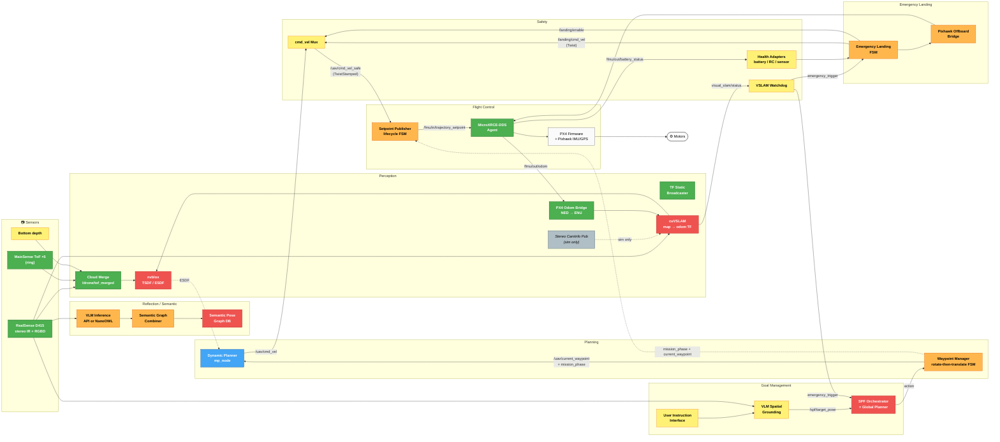

# System Architecture — UAV Autonomy Stack

> Single source of truth for scope freeze. Last updated 2026-05-15.
>
> Companion docs:
> - `PHASE2_VSLAM_INTEGRATION.md` — cuVSLAM + nvblox wiring plan
> - `SEMANTIC_LAYER.md` — VLM-driven semantic map (Component I of master plan)
> - `SEE_POINT_FLY_IMPLEMENTATION.md` — global planner / VLM-driven navigation
> - `PLANNER_BENCHMARK_DRAFT.md` — MP vs MIGHTY vs EGO comparison (draft)
> - `../px4_sim/PX4_VERSION_MIGRATION.md` — keeping SITL aligned with hardware

---

## 1. Context

The system is an autonomous UAV (F450 + Pixhawk FMU-V3, PX4 v1.16.1) for indoor inspection. Compute lives on a Jetson Orin Nano. Perception is built around an Intel RealSense D415 (stereo IR + RGBD + IMU**not** — D415 has no IMU) plus 5 MaixSense MS-A010 ring ToFs + 1 bottom-facing depth (sim already; hardware pending).

The system has two primary autonomy modes:
1. **Commanded navigation** — user issues natural-language instruction → VLM-driven Global Planner (See-Point-Fly extension) → waypoint stream → Dynamic Planner avoids obstacles → PX4 executes.
2. **Emergency landing** — on battery low, signal loss, or sensor failure, the Emergency Landing FSM takes over and lands the drone using bottom + 5 side depth sensors.

Layered on top:
- **Perception**: cuVSLAM (pose + drift-corrected `map → odom`) + nvblox (dense ESDF) + VLM semantic layer
- **Self-adaptation**: mode arbitration, health monitoring, VSLAM tracking watchdog
- **Flight Control**: PX4 onboard, with `setpoint_publisher_node` managing offboard lifecycle

---

## 2. Node inventory

Status legend:
- 🟢 **GREEN** — built & integrated in `planner_ws`
- 🟢ᵃ **GREEN-amber** — built but needs packaging or last-mile wiring
- 🔵 **BLUE** — v1 done, upgrade pending
- 🔴 **RED** — in progress, not yet built
- 🟡 **YELLOW** — TODO, not started
- ⬜ **WHITE** — external (firmware / hardware)

### 2.1 Perception

| Node | Status | Package / path | Subscribes | Publishes | Owner |
|---|---|---|---|---|---|
| Realsense Camera Driver | 🟢 | apt `ros-humble-realsense2-camera` + `uav_hardware_bringup/launch/realsense.launch.py` | USB | `/camera/...` remapped to `/drone/stereo/{left,right}/{image,camera_info}`, `/drone/rgbd/{image,depth,camera_info,points}` | shared |
| ToF MaixSense ring x5 | 🟢 | `maixsense_ws/sipeed_tof_ms_a010_ros` + `uav_hardware_bringup` relays | `/dev/maixsense_tof_<0..4>` (USB) | `/drone/tof_<N>/{depth,points}` (frame `tof_<N>_link`) | shared |
| Bottom depth sensor | 🟢 sim / 🟡 hw | f450 SDF `bottom_cam_link` (sim). Hardware: 6th MaixSense OR D415 bottom slice (TBD) | sim or USB | `/drone/bottom_cam/depth` (sim) / `/sensor_bottom/depth/image_raw` (landing) | hardware track |
| Cloud Merge Node | 🟢 | `cloud_merge/src/cloud_merge_node.cpp` | `/drone/tof_<0..4>/points` | `/drone/tof_merged/points` (frame `base_link`) | shared |
| PX4 Odom Bridge | 🟢 | `cloud_merge/src/px4_odom_bridge.cpp` | `/fmu/out/vehicle_odometry` | `/drone/odom` (ENU), TF `odom → base_link` | shared |
| TF Static Broadcaster | 🟢 | `cloud_merge/src/tf_static_broadcaster.cpp` | (params) | TF: `map → odom` (static, gated by Phase 2), `base_link → {tof_N_link, rgbd_cam_link, ...}` | shared |
| Stereo Camera Info Publisher (sim only) | 🟢 | `cloud_merge/src/stereo_camera_info_publisher.cpp` | (params) | `/drone/stereo/{left,right}/camera_info` | shared |
| **cuVSLAM Node** | 🔴 (Phase 2) | `isaac_vslam.sif` (Singularity) — wiring pending | stereo + camera_info | TF `map → odom`, `visual_slam/tracking/odometry`, `visual_slam/vis/*` | shared |
| **nvblox Node** | 🔴 (Phase 3) | `isaac_vslam.sif` (Singularity) — wiring pending | cuVSLAM pose + `/drone/rgbd/depth` | `nvblox_node/static_esdf_pointcloud`, `static_map_slice`, mesh | shared |

### 2.2 Reflection & World Modelling

| Node | Status | Package / path | Subscribes | Publishes | Owner |
|---|---|---|---|---|---|
| VLM Inference (API variant) | 🟢ᵃ packaging | `/home/shantam/irobot/Cuvslam/vlm_api_inference_node.py` | `/realsense/color/image_raw` | `/vlm/detections` (Detection2DArray) | semantic teammate |
| VLM Inference (local, NanoOWL) | 🟢ᵃ packaging | `/home/shantam/irobot/Cuvslam/nanoowl_inference.py` | RGB image | `/nanoowl/detections` | semantic teammate |
| Semantic Graph Pose Mapping | 🟢ᵃ packaging | `/home/shantam/irobot/Cuvslam/semantic_graph_combiner.py` | `/realsense/depth/image_rect_raw`, `/nanoowl/detections`, `/realsense/color/camera_info` | `/semantic_graph` (JSON String) | semantic teammate |
| **Semantic Pose Graph DB** | 🔴 | (planned) `uav_semantic_keyframes` package | `/semantic_graph`, `visual_slam/vis/pose_graph_nodes` | SQLite DB on disk; `/uav/semantic_keyframes/latest`, `/uav/slam_path_semantic` | semantic teammate |
| **nvblox semantic channel** (Component I.2) | 🔴 (deferred) | `isaac_vslam.sif` config | per-pixel class image | semantic voxels in `.nvblx` map | semantic teammate |

### 2.3 Goal Management & Decision Making

| Node | Status | Package / path | Subscribes | Publishes | Owner |
|---|---|---|---|---|---|
| User Instruction Interface | 🟡 | (planned) `uav_global_planner` | (operator stdin / topic) | `/user/instruction` (String) | SPF track |
| **VLM Spatial Grounding (SPF extension)** | 🟡 | (planned) extension of `vlm_api_inference_node.py` | `/user/instruction`, `/realsense/color/image_raw` | `/spf/target_pose` (PoseStamped) | SPF track |
| **SPF Orchestrator** (= Global Planner) | 🔴 | (planned) `uav_global_planner` | `/spf/target_pose`, `/uav/mission_complete` | yaw setpoints → adapter, XY goals → waypoint_manager action | SPF track |

### 2.4 Planning

| Node | Status | Package / path | Subscribes | Publishes | Owner |
|---|---|---|---|---|---|
| Waypoint Manager | 🟢ᵃ FSM upgrade pending | `uav_local_planner/src/waypoint_manager_node.cpp` | `/uav/navigate_to_goal` (action), `/uav/global_path` | `/uav/current_waypoint` (PoseStamped after upgrade), `/uav/mission_phase`, `/uav/mission_complete` | shared |
| **Dynamic Planner (mp_node)** | 🔵 v1 done | `uav_local_planner/src/mp_node.cpp` | `/drone/tof_merged/points` (today) → `/drone/rgbd/points` (D415-only path), `/drone/odom`, `/uav/current_waypoint` | `/uav/cmd_vel` (TwistStamped), `/uav/vfh_status`, `/uav/mp_diag` | shared |

### 2.5 Self-Adaptation

| Node | Status | Package / path | Subscribes | Publishes | Owner |
|---|---|---|---|---|---|
| **cmd_vel Mux / Mode Arbiter** | 🟡 | (planned) `uav_safety/src/cmd_vel_mux.cpp` | `/uav/cmd_vel`, `/landing/cmd_vel`, `/landing/enable` | `/uav/cmd_vel_safe` → `setpoint_publisher_node` | shared |
| **VSLAM Tracking Watchdog** | 🟡 | (planned) `uav_safety/src/vslam_watchdog.cpp` | `visual_slam/status` | `/uav/emergency_trigger` (Bool) | shared |
| **Health Signal Adapters** | 🟡 | (planned) `uav_health_signals/*` | `/fmu/out/battery_status`, `/fmu/out/manual_control_input`, sensor freshness | `/battery_percent`, `/signal_ok`, `/sensor_ok` | shared |
| Geo-fence, RTL on RC loss, pre-arm checks | 🟢 native | PX4 firmware + QGC config | RC / GPS | PX4 internal failsafe | flight control |

### 2.6 Flight Control

| Node | Status | Package / path | Subscribes | Publishes | Owner |
|---|---|---|---|---|---|
| Setpoint Publisher Node | 🟢ᵃ FSM upgrade pending | `uav_control/src/setpoint_publisher_node.cpp` | `/uav/cmd_vel_safe` (post-mux), `/uav/mission_phase`, `/uav/current_waypoint` (PoseStamped), `/fmu/out/vehicle_status_v1` | `/fmu/in/trajectory_setpoint`, `/fmu/in/offboard_control_mode`, `/fmu/in/vehicle_command` | shared |
| **Emergency Landing Node** | 🟢ᵃ integration | `/home/shantam/irobot/emergency_landing_sim/.../emergency_landing_node_px4.py` | 6 depth images, `/battery_percent`, `/signal_ok`, `/sensor_ok`, `/landing/offboard_ready` | `/landing/cmd_vel`, `/landing/enable`, `/emergency_landing_status` | landing teammate |
| **Pixhawk Offboard Bridge** | 🟢ᵃ integration | `.../pixhawk_offboard_bridge.py` | `/landing/cmd_vel`, `/landing/enable`, `/fmu/out/vehicle_status` | `/fmu/in/offboard_control_mode`, `/fmu/in/trajectory_setpoint`, `/fmu/in/vehicle_command`, `/landing/offboard_ready` | landing teammate |
| MicroXRCE-DDS Agent | 🟢 | external binary `/scratch/$USER/irobot/Micro-XRCE-DDS-Agent/build/MicroXRCEAgent` | PX4 over USB serial or UDP | `/fmu/out/*`, accepts `/fmu/in/*` | shared |
| PX4 Firmware | ⬜ | Pixhawk FMU-V3, v1.16.1 | sensors, RC | flight | flight controller |
| GPS + onboard IMU | ⬜ | Pixhawk | — | feeds PX4 EKF2 | flight controller |

### 2.7 Sim-only support

| Node | Status | Package / path | Notes |
|---|---|---|---|
| ros_gz_bridge | 🟢 | `ros-humble-ros-gzharmonic` apt | Gazebo ↔ ROS 2 topic bridge |
| Gazebo cmdvel bridge | 🟢 (sim of landing) | `emergency_landing_sim/gazebo_cmdvel_bridge` | Twist → SetEntityState; floor-detection |
| Rotor spin animation | 🟢 (sim only) | `emergency_landing_sim/rotor_spin_node` | Visual, not flight-critical |

---

## 3. Top-level data flow

```
  user text ──► User Instruction ──► VLM Spatial Grounding ──► /spf/target_pose
                                                                       │
                                                                       ▼
                                                            SPF Orchestrator (trivial)
                                                            calls /uav/navigate_to_goal
                                                                       │
                                                                       ▼
                                                            Planner Server (action)
                                                                       │ /uav/global_path
                                                                       ▼
                                                  Waypoint Manager (rotate-then-translate FSM)
                                                                   ┌───┴────┐
                                                          ROTATING │        │ TRANSLATING
                                                                   │        │
                              /uav/current_waypoint = (XYcur, yaw_tgt)      /uav/current_waypoint = (XYtgt, yaw_tgt)
                              /uav/mission_phase    = ROTATING               /uav/mission_phase    = TRANSLATING
                                                                   │        │
                                  ┌────────────────────────────────┘        └──┐
                                  ▼                                            ▼
                       Dynamic Planner (mp_node)                  Dynamic Planner (mp_node)
                         emits zero cmd_vel                         emits normal cmd_vel
                                  │                                            │
                                  └──────────────► /uav/cmd_vel ◄──────────────┘
                                                       │
                                                       ▼
                                              cmd_vel MUX  ◄── /landing/cmd_vel (if /landing/enable)
                                                       │  /uav/cmd_vel_safe
                                                       ▼
                                      Setpoint Publisher Node
                                       (reads mission_phase to
                                        emit yaw-only setpoint
                                        during ROTATING)
                                                       │ /fmu/in/trajectory_setpoint
                                                       ▼
                                              MicroXRCEAgent ──► PX4 ──► motors

  Sensor stack → Cloud Merge / Stereo / Depth → cuVSLAM → TF map→odom (drift-corrected)
                                                          │
                                                          └──► nvblox ESDF ──► Global Planner, Dynamic Planner

  VLM Detections → Semantic Graph → Semantic Pose Graph DB
                                                          │
                                                          └──► SPF Orchestrator (v2 closed-loop only)

  Watchdogs (VSLAM tracking, health signals) → /uav/emergency_trigger → Emergency Landing FSM
```

---

## 3.1 System node graph

> Renders in any Mermaid-aware viewer (GitHub, VS Code Mermaid extension, Obsidian, etc.).
>
> Layout: **sensors on left → flow rightward through perception, semantic, planning, safety, control → motors on right**.

### Legend

| Color | Status |
|---|---|
| 🟢 **GREEN** | Built & integrated |
| 🟠 **AMBER** | Built but packaging/upgrade pending |
| 🔵 **BLUE** | v1 done, upgrade pending (e.g., benchmark) |
| 🔴 **RED** | In progress |
| 🟡 **YELLOW** | TODO, not started |
| ⚪ **WHITE** | External (firmware / hardware) |
| ⬛ **GRAY** | Sim-only |

### Graph



### Reading the graph

- **Solid arrows** = primary data flow (every cycle)
- **Dotted arrows** = control signals, optional inputs, or conditional flows
- **Action arrows** labeled "action" = ROS 2 action server calls (with feedback + result)
- **`/landing/enable` arrow into the mux** = control signal that selects which cmd_vel source flows forward

Key observations from the graph:
- The cmd_vel mux is a single chokepoint between planners (MP, Emergency Landing) and the controller (`setpoint_publisher_node`). This is by design — fail-closed safety.
- `WPM → SP` dotted line is the `mission_phase + current_waypoint` channel for yaw-only setpoints during the ROTATING phase (per `SEE_POINT_FLY_IMPLEMENTATION.md` §4.5.3).
- `EL → POB2 → DDS` is a parallel path that bypasses the normal `setpoint_publisher_node` in emergency landing mode. This is a known asymmetry — the landing teammate's design has its own offboard bridge.
- cuVSLAM (CV) is a sink for D415 stereo AND a source for the Watchdog AND nvblox AND the `map → odom` TF — the most-connected node in the perception layer.

---

## 4. TODO (sectioned)

### 4.1 cuVSLAM-related TODO

1. **Phase 2 wiring** (per `PHASE2_VSLAM_INTEGRATION.md`):
   - Gate static `map → odom` in `tf_static_broadcaster.cpp` behind `publish_map_to_odom` param
   - Create `uav_bringup/config/vslam.yaml` with `vslam.enable`, `nvblox.enable`, `px4_feedback.enable`, `semantic.enable` master flags
   - Create `uav_bringup/launch/vslam.launch.py` wrapping `singularity exec isaac_vslam.sif`
   - Add `with_vslam:=false` arg to `full_stack.launch.py`
2. **nvblox launch alongside cuVSLAM** — consume `/drone/rgbd/depth` + cuVSLAM pose; publish ESDF + occupancy
3. **Drop OctoMap subscribers** in `uav_planner_interface` once nvblox publishes equivalents (Phase 3)
4. **VSLAM Tracking Watchdog** — `uav_safety` package; monitors `visual_slam/status`, fires `/uav/emergency_trigger` on `vo_state != TRACKING` for >2s
5. **(Component H, deferred)** PX4 visual odometry feedback — `vslam_to_px4_bridge` publishing to `/fmu/in/vehicle_visual_odometry`. Flag-gated; ships OFF; enable only after flight-validated tracking.

### 4.2 Landing-related TODO

1. **Integrate `emergency_landing_node_px4` + `pixhawk_offboard_bridge`** into `planner_ws` (currently in `/home/shantam/irobot/emergency_landing_sim/`). Either copy into `planner_ws/uav_emergency_landing/` or expose the existing package via colcon.
2. **Bottom sensor decision** (pick one):
   - Add a 6th MaixSense, bottom-facing → exact match to landing teammate's URDF. Needs additional USB hub slot / cable.
   - Remap D415's downward-aligned depth slice → `/sensor_bottom/depth/image_raw`. No new hardware; needs small TF + image extraction node.
3. **Health Signal Adapters** (single new package `uav_health_signals`, ~150 lines total):
   - `/battery_percent` (Float32) ← `/fmu/out/battery_status`
   - `/signal_ok` (Bool) ← `/fmu/out/manual_control_input` freshness OR PX4 commander state
   - `/sensor_ok` (Bool) ← aggregator watching cuVSLAM `visual_slam/status` + per-sensor topic freshness
4. **cmd_vel Mux / Mode Arbiter** — when `/landing/enable: true`, suppress normal planner `/uav/cmd_vel` and forward landing's `/landing/cmd_vel`. **Critical type-mismatch caveat**: `mp_node` publishes `geometry_msgs/TwistStamped` on `/uav/cmd_vel`, but `emergency_landing_node_px4` publishes bare `geometry_msgs/Twist` on `/landing/cmd_vel`. Downstream `setpoint_publisher_node` expects TwistStamped. The mux must either wrap the bare Twist into a TwistStamped before emitting `/uav/cmd_vel_safe`, or `emergency_landing_node_px4` must be patched to publish TwistStamped. Pick the first (don't touch external landing code). Use stock `topic_tools` mux (cannot type-convert; rules out this option), or write a custom `uav_safety/src/cmd_vel_mux.cpp` (~70 lines with the type-wrap logic).
5. **Sim → hardware validation** — run the landing FSM in Gazebo first (current state of the landing pkg), then port thresholds to hardware.

### 4.3 See-Point-Fly related TODO

1. **Package `/Cuvslam/` scripts into `planner_ws/uav_vlm/`**:
   - `vlm_api_inference_node.py` (OpenAI API variant) — keep
   - `nanoowl_inference.py` (local variant) — keep
   - `semantic_graph_combiner.py` — keep
   - Add `package.xml`, `setup.py`, `launch/uav_vlm.launch.py`
   - Update topic names: `/realsense/...` → `/drone/...` (match our existing convention)
2. **User Instruction Interface** (~30 lines):
   - New small Python node listening on `/user/instruction` (`std_msgs/String`)
   - Operator publishes via `ros2 topic pub` or via a small Streamlit/Gradio web UI
   - Alternative: ROS 2 service `/uav/go_to` (text in → success/failure out)
3. **VLM Spatial Grounding Extension**:
   - Extend `vlm_api_inference_node.py` with `mode: spatial_grounding`
   - Prompt template: "Given this image and instruction '<text>', annotate a 2D waypoint where the drone should fly to, plus an estimated travel distance in meters."
   - Output: `/spf/target_pose` (`geometry_msgs/PoseStamped`)
4. **Waypoint Manager FSM upgrade** (the big architectural change — see `SEE_POINT_FLY_IMPLEMENTATION.md` §4.5):
   - Pose-aware rotate-then-translate FSM inside `waypoint_manager_node.cpp` (~150-200 new lines)
   - Upgrade `/uav/current_waypoint` topic type: `PointStamped` → `PoseStamped` (breaking change; only `mp_node` consumes today)
   - New `/uav/mission_phase` (`std_msgs/String`) topic published every cycle: `IDLE | ROTATING | TRANSLATING | COMPLETE`
   - `mp_node.cpp` updated to subscribe to `/uav/mission_phase`; hovers (zero cmd_vel) during ROTATING (~20 line addition)
   - `setpoint_publisher_node.cpp` updated to subscribe to `/uav/mission_phase` and `/uav/current_waypoint`; emits yaw-only trajectory_setpoint (NaN velocity + target yaw) during ROTATING (~40 line addition)
   - Optional companion fix: bump `setpoint_publisher_node` `cmd_timeout_s: 0.5 → 1.0` for more forgiving phase transitions
5. **SPF Orchestrator** (now trivial, ~80 lines Python):
   - Subscribes to `/spf/target_pose` and `/uav/emergency_trigger`
   - On new target, sends full pose (with yaw) to `/uav/navigate_to_goal` action — rotation+translation handled by waypoint_manager internally
   - Publishes `/uav/global_planner_status`: IDLE / EXECUTING / COMPLETE / ABORTED
6. **Closed-loop vs one-shot decision** — start one-shot (VLM called once, target held); upgrade to closed-loop SPF (re-prompt after each phase) in v2. The new waypoint_manager-owned FSM makes closed-loop more tractable because SPF Orchestrator is decoupled from execution timing.

---

## 5. Out of scope (v1)

- RTAB-Map (superseded by cuVSLAM + nvblox)
- OctoMap (superseded by nvblox in Phase 3)
- VFH3D node (legacy, scheduled for removal)
- Temporal snapshots, experience replay buffer (report aspirational; no concrete scope)
- PX4 vision odometry feedback (`/fmu/in/vehicle_visual_odometry`) — deferred until tracking validated in flight
- RTAB-Map specific Knowledge Repository structure (replaced by cuVSLAM pose graph + nvblox + Semantic Pose Graph DB)
- Multi-drone coordination
- Hardware GPS-denied flight (still relies on PX4 EKF2 + GPS; v1.1 with vision feedback enables this)

---

## 6. Hardware bill of materials (drone side)

- F450 frame, 4× motors + ESCs
- Pixhawk FMU-V3 (or compatible) running PX4 v1.16.1
- Jetson Orin Nano 8 GB (JetPack with ROS 2 Humble)
- Intel RealSense D415, USB 3.0 cable
- 5× MaixSense MS-A010 ToF (ring) + 1× MaixSense (bottom) OR D415 bottom-slice remap
- USB hub (4 ports for 4 ring MaixSense; 5th ring + bottom direct to Orin)
- Telemetry radio pair (SiK or equivalent) — TELEM1 to ground laptop QGC
- WiFi for SSH + Foxglove streaming
- Battery 4S (per F450 spec) with PX4-monitored voltage

---

## 7. Glossary

| Term | Definition |
|---|---|
| MP | Motion Primitives — our Dynamic Planner v1 (`mp_node`) |
| cuVSLAM | NVIDIA's Isaac ROS visual SLAM (stereo + optional IMU) |
| nvblox | NVIDIA's dense 3D occupancy + ESDF mapping |
| ESDF | Euclidean Signed Distance Field — voxel grid encoding distance-to-nearest-obstacle |
| VIO | Visual-Inertial Odometry |
| SPF | See, Point, Fly — VLM-driven navigation paradigm (arXiv:2509.22653) |
| DDS | Data Distribution Service — uXRCE-DDS bridges PX4 ↔ ROS 2 |
| FSM | Finite State Machine |
| TF | ROS 2 transform tree |
| ENU / NED | East-North-Up (ROS) / North-East-Down (PX4) — coordinate conventions |
